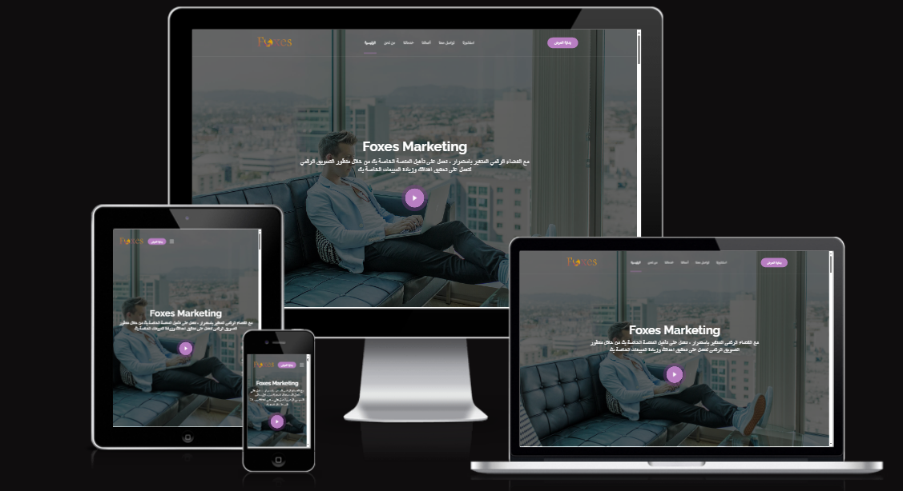

# **Foxes Marketing Portfolio Website**

**Foxes Marketing Portfolio Website** is a modern and responsive marketing portfolio template designed to help you showcase your marketing expertise, services, and success stories. Whether you're a marketing professional, agency, or freelancer, this website offers a sleek and professional platform to present your work. Built with HTML, CSS, and JavaScript, this template is visually appealing and highly customizable, making it a perfect choice for creating an impactful online presence.

## **Features**

- 🌍 **Responsive Design**: The website is fully responsive, ensuring it looks great on desktops, tablets, and smartphones. No matter the screen size, your content will be perfectly displayed.

- 🎨 **Creative UI/UX**: A polished, modern design with an emphasis on clean aesthetics and easy navigation. Interactive elements and smooth animations enhance user experience without overwhelming visitors.

- 📊 **Marketing Showcase**: The template includes sections for showcasing your marketing campaigns, case studies, and success stories. Highlight your work and demonstrate how you've helped businesses grow.

- 💼 **Services & Expertise Section**: A dedicated area to list your marketing services, whether it's SEO, social media marketing, content strategy, or any other area of expertise. Easily editable to fit your specific services.

- 🧑‍🤝‍🧑 **Team Section**: Introduce your team members and their roles. Build trust with potential clients by highlighting your team's experience and professionalism.

- 📬 **Contact Form**: Integrated contact form for easy client outreach. You can customize it to connect to your email or backend server for seamless communication.

- ✨ **Smooth Animations**: Subtle animations and transitions that bring your content to life without distracting from the main message. Enhances the visual appeal of the site.

- 🔍 **SEO Optimized**: The website structure follows SEO best practices, ensuring that your site is discoverable on search engines.

## **Technologies Used**

- **HTML5**: For the semantic structure of the website.
- **CSS3**: Used for styling and creating a responsive, modern layout.
- **JavaScript**: For interactivity such as form validation, dynamic content loading, and animations.
- **Google Fonts**: Stylish, easy-to-read fonts that enhance the website's overall design.
- **Font Awesome**: To add scalable vector icons like social media buttons, checkboxes, and more.

## **Installation**

To get started with the **Foxes Marketing Portfolio Website**, follow these simple steps:

1. **Clone the repository** to your local machine:
   ```bash
   git clone https://github.com/Momen9Sarsour/Foxes-Marketing-Portfolio-Website.git
   ```

2. **Navigate to the project directory**:
   ```bash
   cd Foxes-Marketing-Portfolio-Website
   ```

3. **Open the `index.html` file** in your browser to view the website locally.

4. Optionally, deploy the website on platforms like GitHub Pages, Netlify, or Vercel for live hosting.

## **Customization**

You can easily adapt this template to suit your branding and content:

- **Modify the text**: Update the content in the HTML files to reflect your services, portfolio, and team.
- **Replace images**: Swap out the placeholder images with your own. Don't forget to update the image paths.
- **Change colors**: Customize the CSS file to adjust the color scheme to match your brand identity.
- **Update the contact form**: Configure the contact form to send submissions to your preferred email or backend.

## **Project Images**

Here are some images to showcase the design of the template:

- 📸 **Website Screenshot**:
  

## **Live Demo**

You can view the live demo of the website here:

[Live Demo of Foxes Marketing Portfolio Website](https://example.com)

---

## **Example Usage**

Whether you're a **marketing freelancer**, a **small marketing agency**, or a **digital marketing consultant**, the **Foxes Marketing Portfolio Website** is the ideal foundation to present your services and showcase your previous successes. This clean and professional template helps you attract potential clients and demonstrates your marketing expertise.

---

## 👤 **About Me**

**Momen Sarsour — Computer Systems Engineering**  
📧 Email: **momensarsour5@gmail.com**  
📱 WhatsApp: **+970567077179**

---
